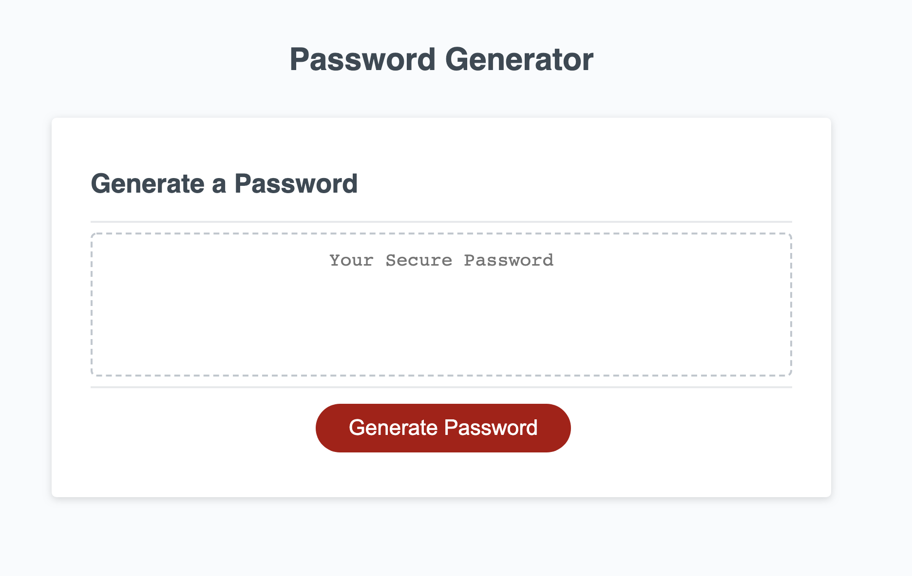

# password-generator

Application live URL: https://houst29476.github.io/password-generator/

GitHub Repository URL: https://github.com/Houst29476/password-generator

Functionality Requirements:

•	Click a button to generate a password

•	present prompts for password criteria
    -	be able to select criteria for password to include

•	when prompted for password length:
    -	be able choose a length between (8 – 128 characters)

•	option to include character types in password:
    -	lowercase 
    -	uppercase 
    -	numeric
    -	special characters

•	input should be validated and at least one character type should be selected

•	password is generated that matches the selected criteria
    -	password is either displayed in an alert or written to the page

Construction Steps:
 
• created arrays for letters, numbers, and special characters.

• created a prompt for user input how many characters they want for their password.

• created a filter (confirm) for which characters they want to include or exclude.

• created a variable to contain the user input.

• created a for loop(s) to generate the randomize password.

• pushed the ranomdized generated password to the text box.

